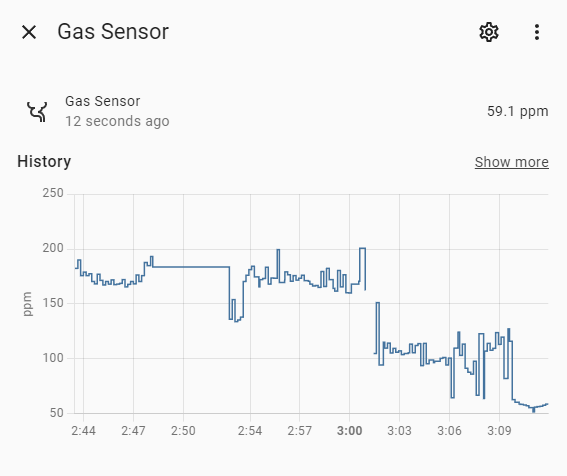
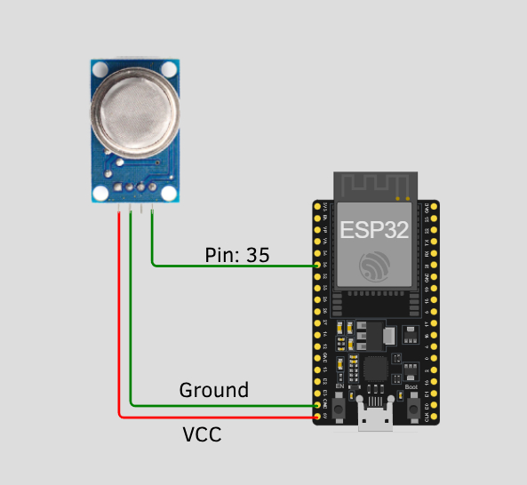

# MQ-5 Gas Leak Sensor Integration

This repository contains the necessary code to integrate an MQ-5 gas leak sensor with an ESP32 and Home Assistant. Follow the steps below to set up and configure the sensor.

[](./imgs/HA-sensor-reading.png)


## Table of Contents
1. [ESP32 Code](#esp32-code)
2. [Home Assistant Integration](#home-assistant-integration)
3. [Endpoints](#endpoints)

## ESP32 Code

1. Clone or download the repository.
2. Navigate to the `/ESP Code` directory.
3. Open the `esp32_code.ino` file in the Arduino IDE.
4. Replace the placeholders for Wi-Fi SSID and password with your network credentials:

    ```cpp
    const char* ssid = "your-ssid";
    const char* password = "your-password";
    ```

5. Upload the code to your ESP32.

### Endpoints

The ESP32 will provide the following endpoints:

- **`ip/`** - Main page with styled sensor readings.
- **`ip/reading`** - Plain text reading of the sensor value.
- **`ip/api`** - JSON object with the sensor reading.

### Wiring

[](./imgs/wiring.jpg)

## Home Assistant Integration

1. Clone or download the repository.
2. Copy the `mq5_gas_leak_sensor` folder from the `/customer_component` directory to the `custom_components` folder in your Home Assistant configuration directory.
3. Restart Home Assistant.
4. After restarting, open your `configuration.yaml` file and add the following configuration:

    ```yaml
    sensor:
      - platform: gas_sensor
        name: "Gas Sensor"
        api_path: "http://192.168.50.130/reading"
        scan_interval: 10 # Interval in seconds
    ```
    _Make sure to replace the `api_path` with the esp32 IP_


5. Save the `configuration.yaml` file and perform another quick restart of Home Assistant.

Your gas sensor should now be integrated with Home Assistant and available for monitoring.

## Additional Notes

- Ensure that your ESP32 is connected to the same network as your Home Assistant instance.
- The `scan_interval` defines how frequently Home Assistant will poll the ESP32 for sensor readings. Adjust this value as needed.

For more information and troubleshooting, refer to the official [Home Assistant documentation](https://www.home-assistant.io/docs/) and [ESP32 documentation](https://docs.espressif.com/projects/esp-idf/en/latest/esp32/).

Feel free to open an issue or submit a pull request if you encounter any problems or have suggestions for improvements.
